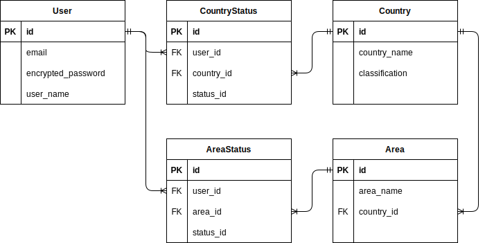

# アプリケーション名
旅行マップ

# アプリケーション概要
各国への訪問状況が一覧表示されるため、訪れたことのない場所がわかる。

# URL
https://ryokomap.onrender.com

# テスト用アカウント
## test1ユーザー
- メールアドレス：test1@test.com
- パスワード：111111

## test2ユーザー
- メールアドレス：test2@test.com
- パスワード：111111

## その他のユーザー
上記以外のユーザーを新規作成いただいて問題ありません。 
定期的にDB再作成するため、データが削除される可能性がある点はご了承ください。 
現状の不具合により、ボタンをクリックしても処理が実行されない場合があります。一度リフレッシュしてから再度ボタンをクリックください。

# 利用方法
## ユーザー登録
1. トップページのヘッダーから「新規登録」ボタンをクリックする
2. ユーザー情報(ユーザー名・メールアドレス・パスワード・パスワードの再入力)を入力する
3. 「新規登録」ボタンをクリックする

## ステータス更新
1. 編集アイコンをクリックし、各国のステータスを変更する
2. 「ステータスを更新」ボタンをクリックし、ステータスを保存する

## 一覧表示
1. 既存ユーザーからURLリンクを受領する
2. ブラウザにリンクを貼り付けると、一覧が表示される

# アプリケーションを作成した背景
旅行先を決めるとき、メンバー全員が訪れていない場所を旅行先にすることが多い。訪れた場所は覚えていることが多いが、訪れていない場所を書き出すことは難しい。一覧を用意し、ステータスを更新することで各場所への訪問状況が確認できるようにすることで、旅行先を決めるのが容易になると考えた。

# 実装した機能について
## 新規登録を行った際に、ユーザーに紐づくステータスが作成される(初期値は"行ってない")

## ステータスの更新は、一括で行うことができる

## リンクアイコンをクリックすると、現ページのURLをコピーできる

# 実装予定の機能
- 日本のみ、都道府県を追加
- フォロー機能
- フォロワー同士かつ承認した場合、フォロワー全員が訪れていない場所をリスト表示する機能

# データベース設計
## ER図

## テーブル
### usersテーブル
| Column             | Type       | Options                        |
| ------------------ | ---------- | ------------------------------ |
| email              | string     | null: false, unique: true      |
| encrypted_password | string     | null: false                    |
| user_name          | string     | null: false                    |

### countriesテーブル
| Column             | Type       | Options                        |
| ------------------ | ---------- | ------------------------------ |
| country_name       | string     | null: false                    |
| classification     | string     | null: false                    |

### country_statusesテーブル
| Column             | Type       | Options                        |
| ------------------ | ---------- | ------------------------------ |
| status_id          | integer    | null: false                    |
| user               | references | null: false, foreign_key: true |
| country            | references | null: false, foreign_key: true |

#### Association
- belongs_to :user
- belongs_to :country

### areasテーブル
| Column             | Type       | Options                        |
| ------------------ | ---------- | ------------------------------ |
| area_name          | string     | null: false                    |
| country            | references | null: false, foreign_key: true |

#### Association
- belongs_to :country

### area_statusesテーブル
| Column             | Type       | Options                        |
| ------------------ | ---------- | ------------------------------ |
| status_id          | integer    | null: false                    |
| user               | references | null: false, foreign_key: true |
| area               | references | null: false, foreign_key: true |

#### Association
- belongs_to :user
- belongs_to :area

# 画面遷移図

# 開発環境
- フロントエンド
- バックエンド
- インフラ
- テスト
- テキストエディタ
- タスク管理

# ローカルでの動作方法
以下のコマンドをターミナルで順に実行。 
% git clone https://github.com/likapantrip/ryokomap.git 
% cd ryokomap 
% bundle install 
% rails db:create 
% rails db:migrate 
% rails db:seed 
% rails s

# 工夫したポイント
- 新規登録した際に、ユーザーに対してステータスデータが作成されること
- 複数データ(ステータス)を一括更新できること
- シェア機能として、URLをコピーできること
  - Clipboard APIを使用
- ミニアプリで検証を行いながら実装したこと
  - [データの一括更新](https://github.com/likapantrip/update-all)
  - [クリップボードへのコピー](https://github.com/likapantrip/copy_link)

# 制作時間
約1ヶ月